# av1-tech
Coding tools study in AOM AV1 video codec.

- `intrapred.py` visualize Intra-predictions
- `wedgemask.py` visualize Wedge masks

## Intra prediction
|`DC_PRED`|`V_PRED`|`H_PRED`|
|:-------:|:------:|:------:|
||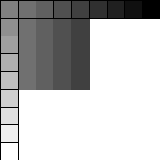|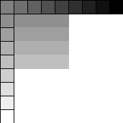|

|`D45_PRED`|`D135_PRED`|`D113_PRED`|
|:--------:|:---------:|:---------:|
|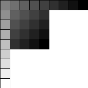|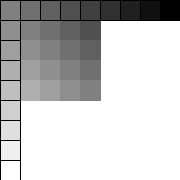||

|`D157_PRED`|`D203_PRED`|`D67_PRED`|
|:---------:|:---------:|:--------:|
|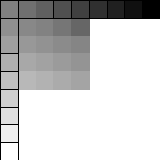|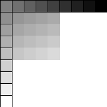|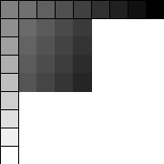|

|`SMOOTH_PRED`|`SMOOTH_V_PRED`|`SMOOTH_H_PRED`|
|:-----------:|:-------------:|:-------------:|
||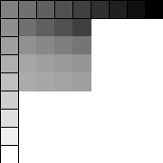|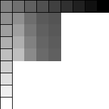|

|`PAETH_PRED`|
|:--------:|
|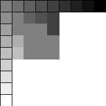|

Directional Intra prediction (8 mode x 7 delta angle):
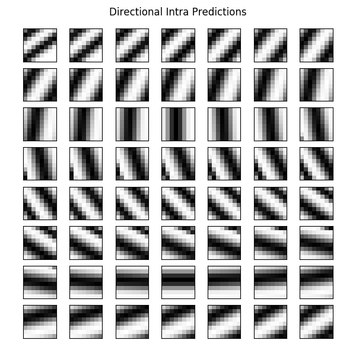

## Wedge mask

## License
MIT License
